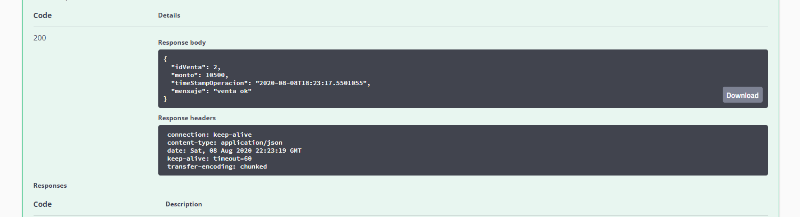

# restaurant-api for technical test

Este repo es para subir el test técnico para evaluación

## Pre-requisitos: 

1. java 8
2. [Apache Maven](https://maven.apache.org/)  
2. [Apache ActiveMQ](http://activemq.apache.org/) (en el application.yml hay un flag para activar o desactivar activemq para el jms)

## Pasos de utilización de ActiveMQ para manejo de JMS

1. Descargar [Apache ActiveMQ](http://activemq.apache.org/)
2. Descomprimir archivo y ejecutarlo: 

	- si es windows activemq.exe start
	- si es linux/mac (revisar permisos de ejecución) ./activemq start
	
3. [Manager de ActiveMQ](http://localhost:8161/)  y usar admin/admin por defecto


## Pasos para ejecutar la aplicación
- Clonar el proyecto:
```
git clone https://github.com/joshone/restaurant-api.git
```
- Compilar el proyecto:
```
mvn clean package
```
- Ejecutar el proyecto localmente:
```
- opción 1: 
mvn spring-boot:run
```
```
- opción 2:
java -jar target/restaurant-api.jar
```
- Por defecto la aplicación carga en el puerto 8080, para ver el swagger debe acceder a la siguiente url
```
[Swagger](http://localhost:8080/swagger-ui.html)
```


### credenciales ejemplo
estas credenciales se encuentran en el archivo application.yml en la siguiente ruta
```
src/main/resources/application.yml
```

	1. jose:alejandro
	2. roberto:cortes
	3. fernando:cortes
	4. carmen:magallanes
	5. jorge:salinas
	
### ejemplo de uso:

1. login con user y password


2. responde de la siguiente manera


3. con el token realizamos la venta 


4. respuesta de la venta



### endpoints: 
no se añadió contexto para la aplicación, los endpoints estan descritos en el swagger y se agrega archivo postman

- post [login](http://localhost:8080/v1/login)
- get [productos](http://localhost:8080/v1/producto/all)
- post [venta](http://localhost:8080/v1/producto/venta)
- post [ventasDelDia](http://localhost:8080/v1/producto/ventasDelDia)

### archivo postman

<a id="raw-url" href="./restaurant-api.postman_collection.json"> Descargar archivo postman</a>